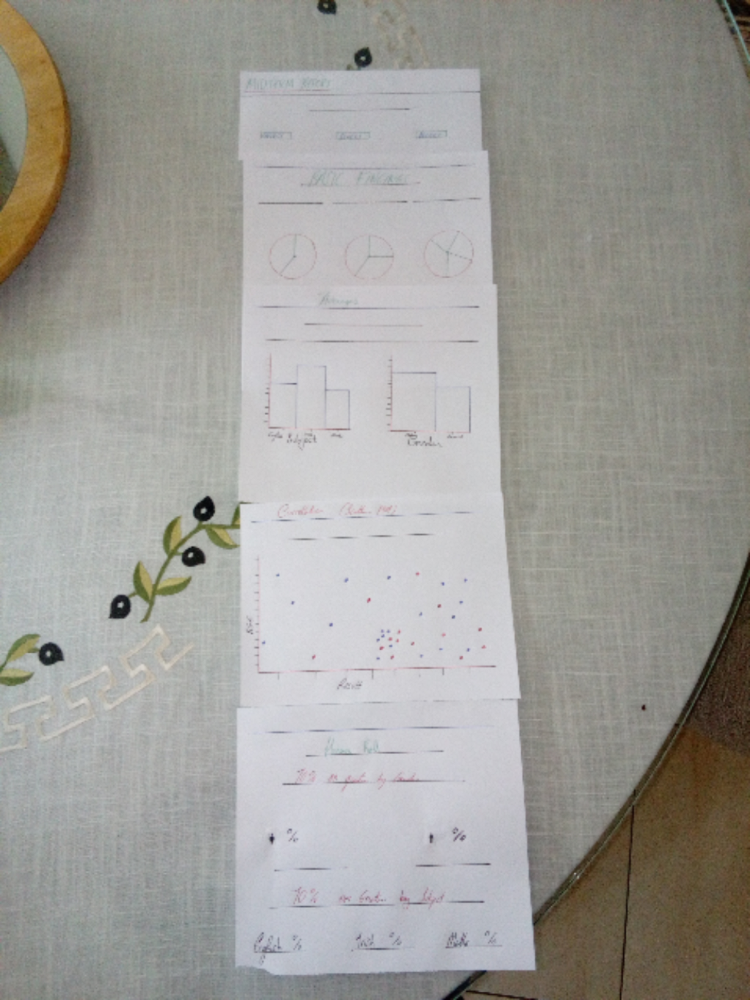
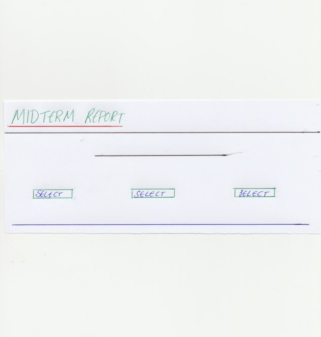
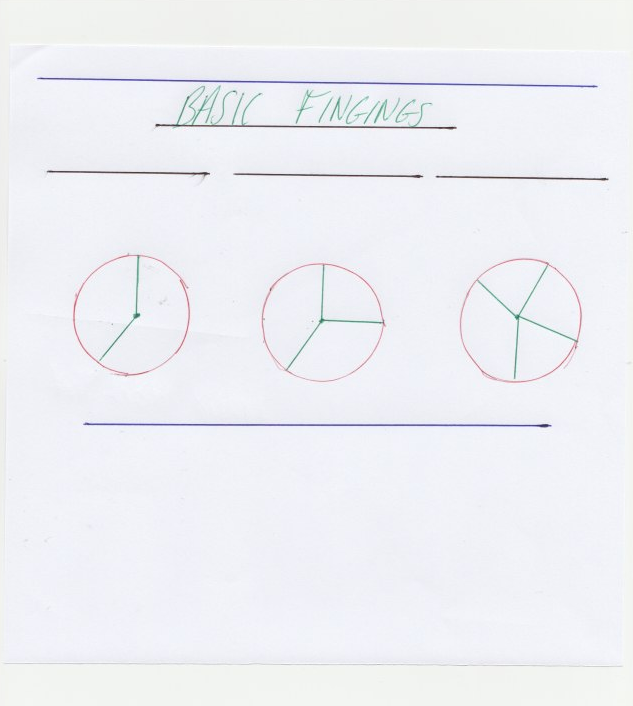
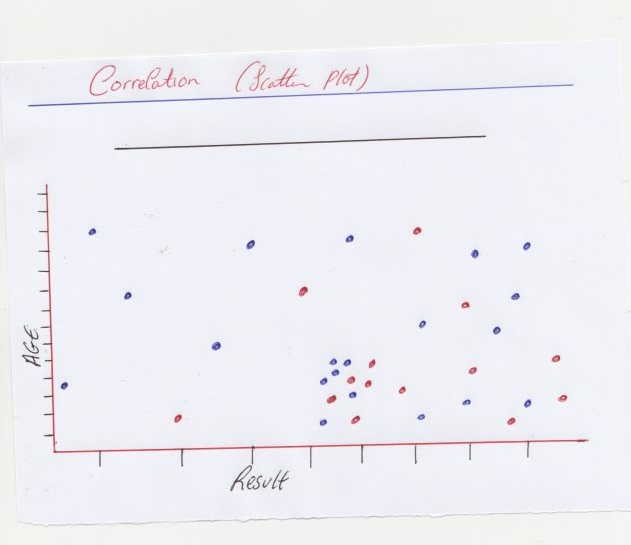

Midterm Report Calculator
===

**Milestone Project Two: Interactive Frontend Development - Code Institute.**

The purpose of the Midterm Report Calculator dashboard is to represent the survey results of 59 different University students (both male and female) across three different disciplines (English, Irish and Maths). Through this dashboard, we can gather and filter statistics from what this microcosm of data can indicate and tell us about a wider demographic and even speculate about what this data means within the categories they represent - most notably the trends in age and gender for students within these disciplines. Or even use the data to speculate the improvements which could change similar data sets in future for the better.

Statistical analysis is something which is vital to understanding sociological trends in society. The importance of this dashboard reflects how and why data is collected and how it is understood. In discovering trends and potential problems, organisations and, in this case, universities can anticipate and work upon these issues before they become bigger problems.

For example, the Midterm Report Calculator can be used to find a particular age group or gender who have struggled the most with their midterm and from that data collection, the issue can be investigated and reviewed further so that the standards of the course can change and improve over time – thereby saving time and money on resources which may not address the issue directly.

Demo
---

A live demo of this project can be found [here](https://martincurran28.github.io/dashboard_assignment/).

UX
---

The Midterm Report Calculator dashboard is aimed at users who coordinate such subjects and wish to understand what this data could tell them about the way they are currently presenting their course to students. The dashboard presents an opportunity for a department to self-critique and ask pertinent questions in order to better their methods of instruction and allow the student to achieve their learning outcomes. Data such as this is invaluable to a department in understanding who they should cater to and how best to present and test the material to students.

In the **Basic Findings** section, a user can find the most primary data displayed in the report. If a department wishes to know the balance between men and women surveyed in all three courses, the pie chart labelled Gender Balance will give them that information. 

Perhaps they only wish to know that gender balance for a single subject and not three. In this case, the user can either use the Filter Selector for Subject at the top of the page to filter the data and return their desired result, or they can simply click on one of the three subject segments in the pie chart labelled Subject Ratio to see the Gender data change according to Subject. 

Maybe a user wishes to know the number of students who achieved a specific grade in a specific subject by a specific gender. In such a case, they may click the desired segments of all three pie charts to see this result. For example, Females doing English who achieved a Grade C will return a result of 4. The Filter Selector can also be used for the same result. 

A user who wishes to know more about average results by gender and subject can use the **Average Result by Subject & Gender** section of the dashboard. Here, the user will encounter two bar charts which both give overall averages for all students surveyed. However, similar to the Basic Findings pie charts, the averages can be manipulated and more refined data searches can be made by clicking the desired bars or using the Selector Filter at the top of the page. This is useful for users who wish to compare subject averages and speculate why there is such a difference between all three and whether or not this difference relates to the uneven number of students by gender taking these subjects.

The **Correlation Between Age & Result** section is for any user interested in the relationship between the percentage result of the student in the midterm and the student’s age. It is colour coded according to gender and the graph is not interactive with the user. However, the data will change accordingly if any other charts of Filter Selectors are manipulated on the page. The scatterplot is a good overall view of three different data types: age, gender and result. Any user interested in finding out exactly which groups are most in need of help and which are succeeding the most will be able to use the Correlation graph to verify this. 

The **Honour Roll** section is the final feature of the dashboard and it is divided into two sections: gender and subject. Any user interested in figuring out the percentage of students who achieved over 70% or more in the midterm can check this section along with the percentage per subject where this feat was achieved. These number boxes are interactive and, again, the user can manipulate the data using any other interactive Chart or Filter Selector on the page. This feature is for any user interested in knowing the success rate by student and subject in order to better understand whether a course’s success rate is in need of review and improved.

You can find mockups of how this project was planned to look below and also in my Github under the **mockups** folder.

**index.html**



**Navbar**



**Basic Findings**



**Averages**


**Correlation**



**Honour Roll**


Features
---
In this section, I will describe the user available features which this project has to offer. 

**Existing Features**

*	**Filter Selectors** – Allows the user to filter the chart data by selecting options from any of the three available filters. The filters are organised by Subject, Gender, and Grade.   
*	**Interactive Pie Charts** – Allows the user to study the data related to Gender Balance, Subject Ratio, and Grade Ratio between all students surveyed. These charts are interactive and the data representation will change depending on what the user is looking to find.
*	**Interactive Bar Charts** – The Bar Charts represent the averages (by percentage) for the all students and are organised by subject and gender. These are also interactive and the data can be refined depending upon what information the user is looking for.
*	**Scatterplot** – Represents the relationship between the age of the student and the student’s result.  The scatterplot is not interactive with the user. However, the results will filter if the user is interactive with any other chart on the page. All charts are responsive to each other.
*	**Number Boxes** – Floating numbers which denote the percentage by gender who achieved a result of 70% or more. There are also number boxes organised by subject which reflect the same principle.

**Features Left to Implement**

* I hope to make the scatterplot available to mobile users soon.


Technologies Used
---
The following list contains all technologies used in the creation of this project.

* **Javascript**
  * Used to programme the dataset to a visual and interactive display.
* **HTML**
  * The project uses HTML as the mark-up language. 
* **CSS**
  * The project uses CSS to style the HTML elements.
* **Bootstrap**
  * Used to add further style to the project. Link provided [here]( https://getbootstrap.com/).
* **Bootswatch**
  * For the stylish navbar theme. Link provided [here](https://bootswatch.com/3/) 
* **dc.js** 
  * dc library used for dimensional charting in graph.js. Link provided [here](https://dc-js.github.io/dc.js/).
* **D3** 
  * d3 library used for data visualisation in graph.js. Link provided [here](https://d3js.org/)
* **Crossfilter**
  * Used to filter the dataset. Link provided [here](http://square.github.io/crossfilter/).  
* **Queue**
  * Used to load the dataset for graph.js.
* **Jasmine**
  * Automated testing Framework used to make sure project was working correctly. Link procided [here](https://cdnjs.com/libraries/jasmine).  
* **Font Awesome**
  * Used to add visual icons for the Honour Roll section of the project. Link provided [here]( https://fontawesome.com/).
* **Google Fonts**
  * Used to add specific a pecific font to the HTML text. Link provided [here]( https://fonts.google.com/).


Testing
---

The stories shared in the UX section all achieve their expected purpose and the dashboard is a great visual and interactive data resource for users and educational departments to benefit and study from.

To ensure this, I used Jasmine for automated testing to make sure my graphs and data displayed the information correctly. Given the interactive nature of these charts to each other, I planned and configured specific tests to make sure they operated together in the most harmonious way possible when a filter (or filters) are applied. The tests I undertook were maths-based and tested whether I had implemented my desired logic correctly in every situation which may arise. 

I began by testing for the default display so that each time a user opens the dashboard they are immediately presented with the correct starting data. In order to test this, I used a calculator prototype function which allowed me to add, subtract, divide and multiply for my results. It seemed like the best way of testing logic that was very maths based. An example of a default setting test which I used was for the Gender Balance pie chart where I have to make sure the dashboard opens with exactly 20 female and 39 male students to make up the total of 59 participants. The test was simply a matter of adding the total number of males to females with the expected value as the test value being tested. The result was further verified by a page refresh to check that this value was correct. You can note the test below:
           
    ```
    describe("Addition function", function() {
	   it("should return 59", function() {
	       calc.add(20);
	       calc.add(39);
	       expect(calc.value).toBe(59);
	   });
	        
	});
    ```

A similar default test was applied to nearly every other graph and numberbox except for the scatter plot. I decided to manually test the correlation graph as it seems more user-orientated than the other graphs I plotted, and therefore I believe a manual approach to its testing was for the best. For the scatterplot, I had to manually make sure the dots appeared and disappeared according to which filter was being implemented. This feature is functional and works well.

After I tested the graphs’ default display, I started to test their functionality when filters were applied. One of the tests I used was selecting the English and Irish in Basic Findings, thereby narrowing the filter from three subjects to two, and then making sure the female number box in the Honour Roll section changed accordingly from 35.00% (for three subjects) to 31.25% (for two subjects) to reflect the change in data. In this case, the number of females to achieve the 70% or more is a fraction of 5/16 (five females achieved the honour out the total number of females in both subjects). Therefore, the test had to be the following in order to achieve a percentage and pass. The result was further verified by a page refresh to check that this value was correct. You can note the test below:

	```
	describe("Honour function", function() {
		  it("should return 16.666666666666664", function() {
		      calc.add(5);
		      calc.divide(16);
		      calc.multiply(100);
		      expect(calc.value).toBe(31.25);
		});
		        
	});
    ```

I also tested the logic I had written for specific parts of the dashboard. Automated testing gave me an opportunity to go back over the logic I had prepared to make sure it was working effectively. My averages section, for example, were put to the test as not only did the logic have to pass the test for its default value of overall average when the page begins, but also account for the change in data if a user applied filters to their search for more refined average counts. In tests like these, I found out that it was important to note the changing values you should expect if such filters are used and then test to see if that logic works through that expected result. This is a rule I tried to follow while preparing these suites. I consistently worked out the expected values and tested the code against that value. An example of such a test for the averages section was testing the value of the male average if the user selected only one subject, English. To find the average, I had to find the total midterm results for all male students (605) and divide it by the number of male students taking English (9). 

The result was further verified by a page refresh to check that this value was correct. You can note the test below:

	```     
	describe("Average function", function() {
        it("should return 67.22222222222223", function() {
	       calc.add(605);
	       calc.divide(9);
	       ex-pect(calc.value).toBe(67.22222222222223);
	    });
	        
	});
	```

The Honour Roll section was tested in a similar way. I wanted to test how power the logic for this section could get, so I devised a test to measure whether the female number box would only display the number of females who achieved over 70% for all three subjects or whether it could give the expected value when subjects are filtered. If the user wanted to see the number of female students who achieved 70% or more in Irish, the fraction is 1/6(only one female achieved this feat out of six in total taking the subject). In this case, the fraction is multiplied by 100 and the correct values is (rounded up) to 16.67 on the graph. This result was further verified by a page refresh to check that this value was correct. You can note the test below:

    ```
    describe("Honour function", function() {
	    it("should return 16.666666666666664", function() {
	       calc.add(1);
	       calc.divide(6);
	       calc.multiply(100);
	       ex-pect(calc.value).toBe(16.666666666666664);
	    });
	        
	});
   ```
   
For manual testing, I checked the functionality of each graph in respect of the automated tested I had undertaken to ensure the results and data were appearing appropriately and as expected. Although it was explained that graphs aren’t responsive, it was important to me to use a solid grid system to make the most of the dashboard’s presentation. Especially on multiple devices. The major display difference between desktop and mobile is the arrangement of elements. The sections change from a horizontal to vertical arrangement on mobile devices and tablets (with the exception of the iPad Pro). Each page of the site was tested across three different browsers (Google Chrome, Safari, Firefox) on multiple mobile devices (iPhone 6, 7, 8, iPad, iPad Pro, Pixel, Pixel 2, Samsung Galaxy) to ensure compatibility and responsiveness. One particular except is the scatter plot which is not available on mobile. However, I did configure a show-for-landscape media query for tablet: ‘@media screen and (max-device-width: 800px) and (orientation: landscape)‘. This is a feature which I hope to integrate to mobile devices in the very immediate future.

Deployment
---

This site is hosted using GitHub pages, deployed directly from a separate git branch called “gh-pages” as opposed to the master branch. Through the command line, I created the new branch by using this command: `git checkout –b gh-pages`. I then push my branch using `git push origin gh-push`. After inputting my GitHub credentials, I was given the URL to the deployed page where my project was hosted.

To run this code locally, you may clone this repository from the **Clone or Download** button at the top of the page and writing git clone followed by that URL you have cloned into an editor. To cut ties with Github use `git remote rm origin` in your terminal.


Credits
---
**Content**

* All content for this dashboard was written by me. The survey data used was also devised and written by me.

**Media**

* No photos, videos or media content were used in this dashboard project.

**Acknowledgements**

* My thanks to the lecturers and coordinators at Code Institute for their tutorials and instruction throughout the Interactive Frontend Development module. Their website can be found [here]( https://codeinstitute.net/).
* A very useful tutorial on how to deploy the project using GitHub Pages. Click [here]( https://www.youtube.com/watch?v=TUJekd0reVQ) for the video.
* The full navbar I used for this project was taken from the Bootswatch website and you can find the full HTML code for the navbar on [this]( https://bootswatch.com/flatly/) page.
* Lastly, to my parents, Seamus and Susan, for their constant support and help throughout the prep and creation of this Milestone project.


