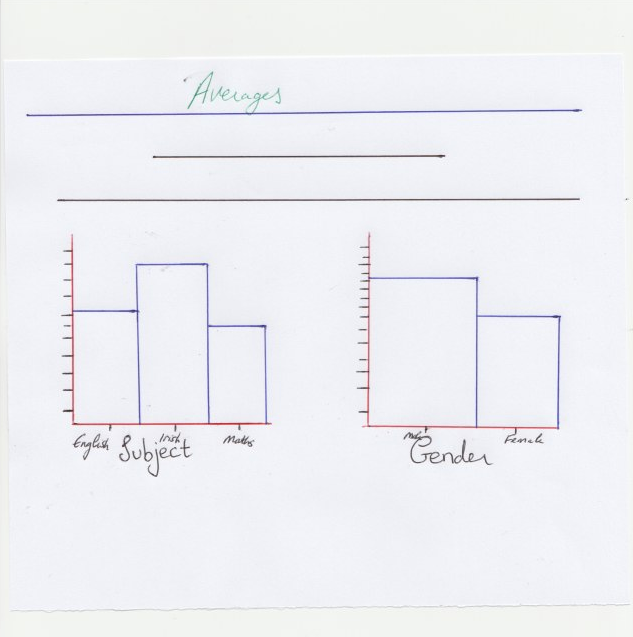
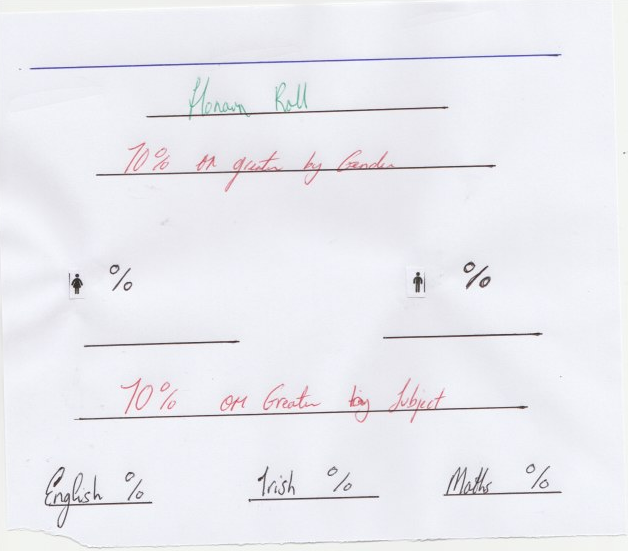

Midterm Report Calculator
===

**Milestone Project Two: Interactive Frontend Development - Code Institute.**

The purpose of the Midterm Report Calculator dashboard is to represent the survey results of 59 different University students (both male and female) across three different disciplines (English, Irish and Maths). Through this dashboard, we can gather and filter statistics from what this microcosm of data can indicate and tell us about a wider demographic and even speculate about what this data means within the categories they represent - most notably the trends in age and gender for students within these disciplines. Or even use the data to speculate the improvements which could change similar data sets in future for the better.

Statistical analysis is something which is vital to understanding sociological trends in society. The importance of this dashboard reflects how and why data is collected and how it is understood. In discovering trends and potential problems, organisations and, in this case, universities can anticipate and work upon these issues before they become bigger problems.

For example, the Midterm Report Calculator can be used to find a particular age group or gender who have struggled the most with their midterm and from that data collection, the issue can be investigated and reviewed further so that the standards of the course can change and improve over time – thereby saving time and money on resources which may not address the issue directly.

UX
===

The Midterm Report Calculator dashboard is aimed at users who coordinate such subjects and wish to understand what this data could tell them about the way they are currently presenting their course to students. The dashboard presents an opportunity for a department to self-critique and ask pertinent questions in order to better their methods of instruction and allow the student to achieve their learning outcomes. Data such as this is invaluable to a department in understanding who they should cater to and how best to present and test the material to students.

In the **Basic Findings** section, a user can find the most primary data displayed in the report. If a department wishes to know the balance between men and women surveyed in all three courses, the pie chart labelled Gender Balance will give them that information. 

Perhaps they only wish to know that gender balance for a single subject and not three. In this case, the user can either use the Filter Selector for Subject at the top of the page to filter the data and return their desired result, or they can simply click on one of the three subject segments in the pie chart labelled Subject Ratio to see the Gender data change according to Subject. 

Maybe a user wishes to know the number of students who achieved a specific grade in a specific subject by a specific gender. In such a case, they may click the desired segments of all three pie charts to see this result. For example, Females doing English who achieved a Grade C will return a result of 4. The Filter Selector can also be used for the same result. 

A user who wishes to know more about average results by gender and subject can use the **Average Result by Subject & Gender** section of the dashboard. Here, the user will encounter two bar charts which both give overall averages for all students surveyed. However, similar to the Basic Findings pie charts, the averages can be manipulated and more refined data searches can be made by clicking the desired bars or using the Selector Filter at the top of the page. This is useful for users who wish to compare subject averages and speculate why there is such a difference between all three and whether or not this difference relates to the uneven number of students by gender taking these subjects.

The **Correlation Between Age & Result** section is for any user interested in the relationship between the percentage result of the student in the midterm and the student’s age. It is colour coded according to gender and the graph is not interactive with the user. However, the data will change accordingly if any other charts of Filter Selectors are manipulated on the page. The scatterplot is a good overall view of three different data types: age, gender and result. Any user interested in finding out exactly which groups are most in need of help and which are succeeding the most will be able to use the Correlation graph to verify this. 

The **Honour Roll** section is the final feature of the dashboard and it is divided into two sections: gender and subject. Any user interested in figuring out the percentage of students who achieved over 70% or more in the midterm can check this section along with the percentage per subject where this feat was achieved. These number boxes are interactive and, again, the user can manipulate the data using any other interactive Chart or Filter Selector on the page. This feature is for any user interested in knowing the success rate by student and subject in order to better understand whether a course’s success rate is in need of review and improved.

You can find mockups of how this project was planned to look below and also in my Github under the **mockups** folder.

**index.html**

**Navbar**

**Basic Findings**

**Averages**

**Correlation**

**Honour Roll**

Features
---
In this section, I will describe the user available features which this project has to offer. 

**Existing Features**

*	**Filter Selectors** – Allows the user to filter the chart data by selecting options from any of the three available filters. The filters are organised by Subject, Gender, and Grade.   
*	**Interactive Pie Charts** – Allows the user to study the data related to Gender Balance, Subject Ratio, and Grade Ratio between all students surveyed. These charts are interactive and the data representation will change depending on what the user is looking to find.
*	**Interactive Bar Charts** – The Bar Charts represent the averages (by percentage) for the all students and are organised by subject and gender. These are also interactive and the data can be refined depending upon what information the user is looking for.
*	**Scatterplot** – Represents the relationship between the age of the student and the student’s result.  The scatterplot is not interactive with the user. However, the results will filter if the user is interactive with any other chart on the page. All charts are responsive to each other.
*	**Number Boxes** – Floating numbers which denote the percentage by gender who achieved a result of 70% or more. There are also number boxes organised by subject which reflect the same principle.

**Features Left to Implement**

* I hope to make the scatterplot available to mobile users soon.

Technologies Used
---
The following list contains all technologies used in the creation of this project.

* **Javascript**
  * Used to programme the dataset to a visual and interactive display.
* **HTML**
  * The project uses HTML as the mark-up language. 
* **CSS**
  * The project uses CSS to style the HTML elements.
* **Bootstrap**
  * Used to add further style to the project. Link provided [here]( https://getbootstrap.com/).
* **Bootswatch**
  * For the stylish navbar theme. Link provided [here](https://bootswatch.com/3/) 
* **dc.js** 
  * dc library used for dimensional charting in graph.js. Link provided [here](https://dc-js.github.io/dc.js/).
* **D3** 
  * d3 library used for data visualisation in graph.js. Link provided [here](https://d3js.org/)
* **Crossfilter**
  * Used to filter the dataset. Link provided [here](http://square.github.io/crossfilter/).  
* **Queue**
  * Used to load the dataset for graph.js.
* **Font Awesome**
  * Used to add visual icons for the Honour Roll section of the project. Link provided [here]( https://fontawesome.com/).
* **Google Fonts**
  * Used to add specific a pecific font to the HTML text. Link provided [here]( https://fonts.google.com/).
